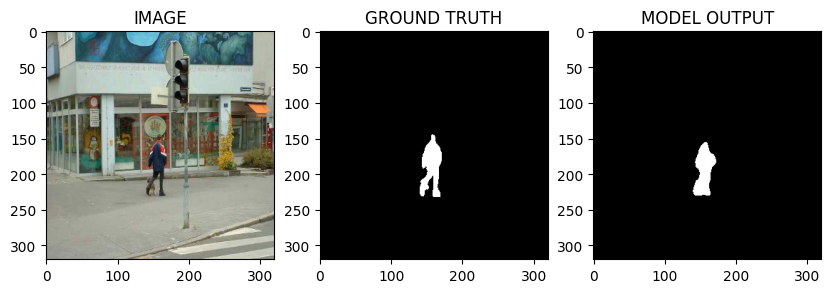

# Human Image Segmentation with PyTorch

This project implements a semantic segmentation model to isolate human figures from their backgrounds. It utilizes a **U-Net** architecture with a pre-trained **EfficientNet-B0** backbone.

## Architecture

-   **Model:** U-Net (Encoder-Decoder architecture).
-   **Encoder (Backbone):** EfficientNet-B0 (pre-trained on ImageNet). The encoder extracts high-level features while reducing spatial dimensions.
-   **Decoder:** Upsamples the features back to the original image size, using skip connections from the encoder to recover fine spatial details.

## Training Details

-   **Dataset:** Human Segmentation Dataset (Images and corresponding binary masks).
-   **Augmentations:** Resizing, horizontal flips, and vertical flips implemented via `Albumentations`.
-   **Loss Function:** A hybrid loss combining **Dice Loss** and **Binary Cross Entropy (BCE)** to handle class imbalance and ensure smooth boundaries.
-   **Optimization:** Trained using the Adam optimizer with a learning rate of 0.003.

## Result

**Comparison of the original image, the ground truth mask, and the model's predicted output after 25 epochs.**

